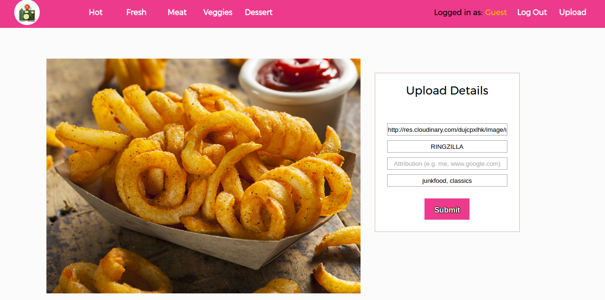

##9Brag

[9brag live](https://www.9brag.com)

9Brag is a full stack web application that embraces the futility and frivolousness of the internet era as represented by internet memes and karma. It utilizes Ruby on Rails on the backend, a PostgreSQL database, and React.js with a Redux architectural framework on the frontend.

###Features and Implementation

####Single-Page App

9Brag uses React and Redux to make AJAX calls to dynamically render the stalest, most beloved memes and their trashy comments. Navigation occurs without multiple full http requests and content is queried and populated smooth rendering, thanks to the many React components which dispatch actions through the React Router.

```javascript
<Router history={ hashHistory } onUpdate={() => window.scrollTo(0, 0)}>
  <Route path="/" component={ App } onEnter={ this.props.requestAllMemes }>
    <IndexRoute component={ MemeIndexContainer } />;
    <Route path="/tagged/:tags" component={ MemeIndexContainer } onEnter={ this.props.requestAllMemes }/>
    <Route path="/hot" component={ MemeIndexContainer } onEnter={ this.props.requestAllMemes }/>
    <Route path="/fresh" component={ MemeIndexContainer } onEnter={ this.props.requestAllMemes }/>
    <Route path="/memes/:memeId" component={ MemeShowContainer } />
    <Route path="/users/:userId" component={ UserPageContainer } onEnter={ this._fetchUserData }/>
    <Route path="/upload" component={ UploadFormContainer } onEnter={ this._ensureLoggedIn } />
    <Route path="/login" component={ SessionFormContainer } onEnter={ this._redirectIfLoggedIn } />
    <Route path="/signup" component={ SessionFormContainer } onEnter={ this._redirectIfLoggedIn } />
  </Route>
</Router>
  ```

####Authentication

User authentication happens on the frontend framework using actions dispatched by components using the state of `Store.session` to populate a current user. Sensitive information is kept out of the frontend of the app by making an API call to `SessionsController#create`. Updating url images has an ajax call to a custom Rails route that relies on cookies defining the current user to make patch requests so users cannot alter other users.

```ruby
      patch 'updatephoto' => "users#updatephoto", as: "updatephoto"
  ```

```javascript
export const updateUser = (user, success) => {
  $.ajax({
    method: "PATCH",
    url: `api/updatephoto`,
    data: {user: user},
    success,
    error: () => alert("Unable to update user")
  });
}
  ```

####Picture Submission and Storage

On the database side, `meme`s are stored in one table in the database, which contains columns for `id`, `url` and `titles`. Multiple associations are queried upon entrance of the memes index which forms the basis of a meme's presentation.



Pictures can be submitted and stored on Cloudinary. Memes are rendered in two different components: the `MemeIndex` component, which shows a collection of `MemeIndexItem` which contain the the title, image, upvotes, tags, and number of comments, and the `MemeShow` component, which expands upon a `MemeIndexItem` with information including comments and a comment submission form.

####Upvote and Tag Join Tables

The database is also populated with multiple join tables describing the relationship between `user`s, `tagname`s, and `meme`s. ActiveRecord associations create the `tags` join table between `tagname`s and `meme`s, the upvotes/downvotes through the polymorphic association with a value table describing the `vote_val` between memes and users, and the user comments relationship through users, memes, and their comments. These associations allow for instantaneous updates on likes and comments. The models maintain their simplicity and autonomy, with their associations and the jbuilder views doing the majority of the work.

```ruby
class Meme < ActiveRecord::Base
  validates :url, :title, presence: true

  def ourTags=(tags)
    @tags = tags
  end

  include Votable

  belongs_to :user

  has_many :comments
  has_many :tags, inverse_of: :meme
  has_many :votes, :as => :votable

  has_many :tagnames,
    through: :tags,
    source: :tagname

end
  ```

###Future Directions for the Project

Future directions for this project include elaborating upon the idea of more karma being better and worth more, more irritating bells and whistles, unnecessary monetization, an infinite scroll on the memes index, and the ability to upvote and downvote comments.
