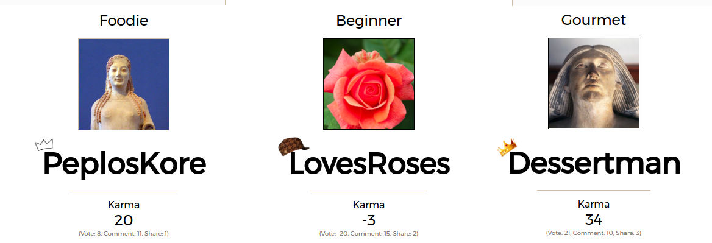

## 9Brag

[9brag live](http://www.9brag.com)

9Brag is a full stack web application that lets you post pictures of food that you've eaten. It utilizes Ruby on Rails on the backend, a PostgreSQL database, and React.js with a Redux pattern on the frontend.

### Features and Implementation

#### Single-Page App

9Brag uses React and Redux to make AJAX calls to dynamically render the images of delicious food accompanied by classic internet comments. Navigation occurs by rerendering components with different JSON data. This JSON content is queried, populated, and smoothly rendered thanks to the many React components which dispatch actions through the React Router.

```javascript
<Router history={ hashHistory } onUpdate={() => window.scrollTo(0, 0)}>
  <Route path="/" component={ App } onEnter={ this.props.requestAllMemes }>
    <IndexRoute component={ MemeIndexContainer } />;
    <Route path="/tagged/:tags" component={ MemeIndexContainer } onEnter={ this.props.requestAllMemes }/>
    <Route path="/hot" component={ MemeIndexContainer } onEnter={ this.props.requestAllMemes }/>
    <Route path="/fresh" component={ MemeIndexContainer } onEnter={ this.props.requestAllMemes }/>
    <Route path="/images/:memeId" component={ MemeShowContainer } />
    <Route path="/users/:userId" component={ UserPageContainer } onEnter={ this._fetchUserData }/>
    <Route path="/upload" component={ UploadFormContainer } onEnter={ this._ensureLoggedIn } />
    <Route path="/login" component={ SessionFormContainer } onEnter={ this._redirectIfLoggedIn } />
    <Route path="/signup" component={ SessionFormContainer } onEnter={ this._redirectIfLoggedIn } />
  </Route>
</Router>
  ```

#### Authentication

User authentication happens on the frontend framework using actions dispatched by components using the state of `Store.session` to populate a current user. Sensitive information is kept out of the frontend of the app by making an API call to `SessionsController#create`. Updating url images has an ajax call to a custom Rails route that relies on cookies defining the current user to make patch requests so users cannot alter other users.

```ruby
      patch 'updatephoto' => "users#updatephoto", as: "updatephoto"
  ```

```javascript
export const updateUser = (user, success) => {
  $.ajax({
    method: "PATCH",
    url: `api/updatephoto`,
    data: {user: user},
    success,
    error: () => alert("Unable to update user")
  });
}
  ```

#### Picture Submission and Storage

On the database side, `meme`s (food images) are stored in one table in the database, which contains columns for `id`, `url` and `titles`. Multiple associations are queried upon entrance of the images index which forms the basis of an image's presentation.


Pictures can be submitted and stored on Cloudinary. Memes are rendered in two different components: the `MemeIndex` component, which shows a collection of `MemeIndexItem` which contain the the title, image, upvotes, tags, and number of comments, and the `MemeShow` component, which expands upon a `MemeIndexItem` with information including comments and a comment submission form.

#### Upvote and Tag Join Tables

The database is also populated with multiple join tables describing the relationship between `user`s, `tagname`s, and `meme`s. ActiveRecord associations create the `tags` join table between `tagname`s and `meme`s, the upvotes/downvotes through the polymorphic association with a value table describing the `vote_val` between memes and users, and the user comments relationship through users, memes, and their comments. These associations allow for instantaneous updates on likes and comments. The models maintain their simplicity and autonomy, with their associations and the jbuilder views doing the majority of the work.

```ruby
class Meme < ActiveRecord::Base
  validates :url, :title, presence: true

  def ourTags=(tags)
    @tags = tags
  end

  include Votable

  belongs_to :user

  has_many :comments
  has_many :tags, inverse_of: :meme
  has_many :votes, :as => :votable

  has_many :tagnames,
    through: :tags,
    source: :tagname

end
  ```

#### User Karma

User karma is calculated on the backend for each user when user's personal page is loaded. This number is created by summing the user's submitted images, the vote total of those images, and the number of comments on their images.

```ruby
  json.set! "#{@user.id}" do
    json.extract! @user, :id, :name, :url
    json.karmatot @user.memes.map{|meme| meme.votes.map{|vote| vote.vote_val}.sum}.sum + @user.memes.length + @user.memes.map{|meme| meme.comments.length}.sum
    json.votekarma @user.memes.map{|meme| meme.votes.map{|vote| vote.vote_val}.sum}.sum
    json.interestkarma @user.memes.map{|meme| meme.comments.length}.sum
    json.contributekarma @user.memes.length
  end
```

This karma is used to influence what title they have on their userpage, as well as what hat they get over their username.



#### Infinite Scroll

On meme index pages, images are fed to you 6 at a time using a scroll event listener that calls `infScrollMemes` when you hit the bottom of the page. `infScrollMemes` dispatches either `requestAllMemes` with an appropriate sort, or `requestTaggedMemes` depending on the current url. In order to paginate correctly and send back the correct data, the `lastMemeId` is also sent.

```javascript
componentDidUpdate(){
  document.addEventListener('scroll', this.infScrollMemes);
}

componentWillUnmount(){
  document.removeEventListener('scroll', this.infScrollMemes);
}

infScrollMemes(){
    if (document.body.scrollHeight == (document.body.scrollTop + window.innerHeight)) {
      if(this.props.memes.length !== 0){
        const tag = this.props.params.tags;
        const hotOrFresh = this.props.location.pathname;
        const lastMemeId = parseInt(Object.keys(this.props.memes[this.props.memes.length-1])[0]);
        if(tag === undefined){
          this.props.requestAllMemes(hotOrFresh, lastMemeId);
        } else {
          this.props.requestTaggedMemes(tag, lastMemeId);
        }
      }
    }
}
```

The backend uses this data in varying ways to search for the correct meme; it utilizes ascending or descending `id`s for fresh, regular, and tagged sorts, but a karma recalculation is needed for the hot sort. A future implementation might cache karma data and limit by date so as to increase efficiency.

```ruby
def getTaggedMemes
  @lastMeme = params[:lastMeme].to_i

  @start = @lastMeme
  @tagname = Tagname.where(tagname: params[:tag])[0]
  @memes = @tagname.memes.where("memes.id > ?", @start).limit(6)
  render "api/memes/index"
end
```

### Future Directions for the Project

Future directions for this project include elaborating upon the idea of more karma being better and worth more, unnecessary monetization, and the ability to upvote and downvote comments.
